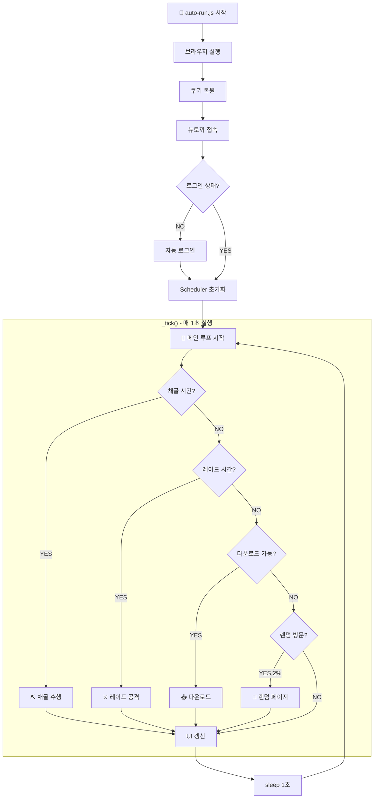
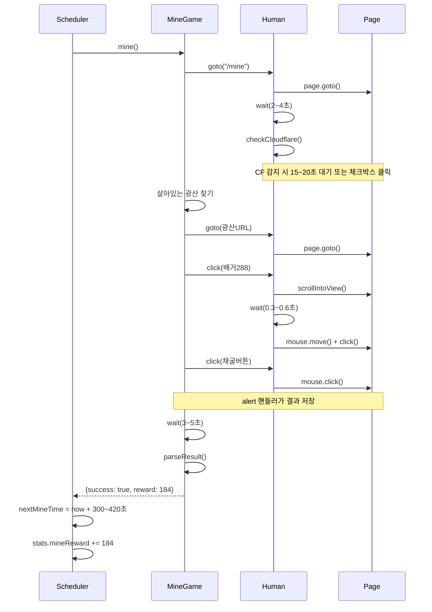
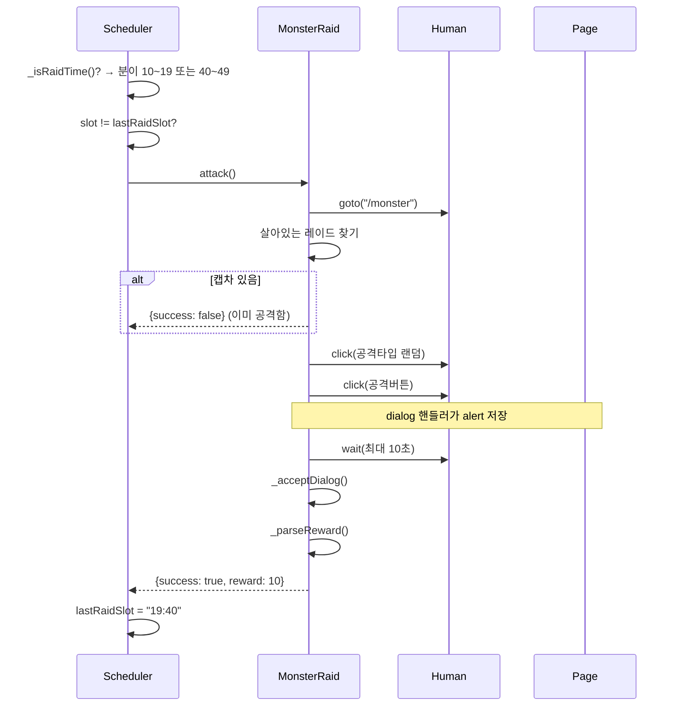
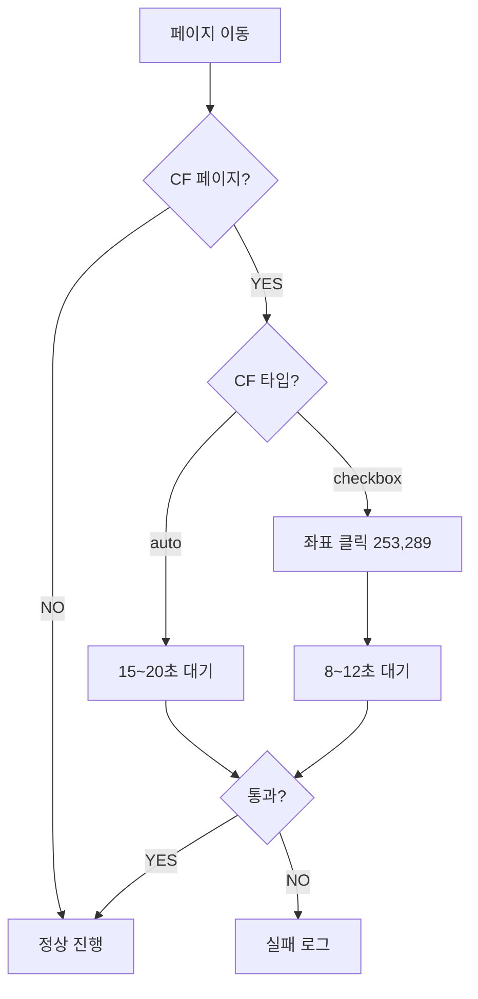

# 🔄 Stealth-Clicker 동작 흐름도

> **작성일**: 2026-01-04  
> **버전**: 리팩토링 후 (Scheduler 기반)

---

## 📊 전체 흐름 (Mermaid)



---

## 🕐 시간 기반 트리거

```
현재 시각: 19:40:30

[채굴 체크]
nextMineTime = 19:38:00 (다음 채굴 예정)
now >= nextMineTime? → YES → 채굴!
                    → nextMineTime = now + 300~420초

[레이드 체크]
현재 분: 40분
40분 >= 40 && 40분 < 50? → YES (레이드 시간!)
lastRaidSlot == "19:40"? → NO → 공격!
                        → lastRaidSlot = "19:40"

[다운로드 체크]
FEATURES.DOWNLOAD == false → 스킵
(true면) nextDownloadTime <= now → 다운로드
```

---

## ⛏️ 채굴 상세 흐름



---

## ⚔️ 레이드 상세 흐름



---

## 📥 다운로드 흐름 (현재 더미)

```
1. FEATURES.DOWNLOAD = false → 스킵
2. (구현 예정)
   - 게시판 목록 이동
   - 플로피 아이콘 있는 게시물 찾기
   - 게시물 진입
   - 첨부파일 다운로드
   - 진행 상황 저장
3. 현재: sleep(180초) 더미 대기
```

---

## 🖥️ UI 갱신 흐름

```javascript
// 매 1초마다 Scheduler._tick() 끝에서 호출
_updateUIRemaining() {
    const remaining = Math.max(0, this.nextMineTime - Date.now());
    this.ui.updateRemaining(remaining);
}

// TerminalUI 내부
render() {
    // remaining이 자동으로 1초씩 감소 (setInterval)
    const min = Math.floor(remaining / 60000);
    const sec = Math.floor((remaining % 60000) / 1000);
    waitStr = `${min}분 ${sec}초`;
}
```

---

## 🔐 클라우드플레어 처리



**CF 감지 조건:**

```javascript
// 페이지 제목으로 감지
title.includes('Just a moment') ||
title.includes('Checking your browser')
```

---

## 📁 파일별 역할

| 파일 | 역할 | 주요 함수 |
|:---|:---|:---|
| `Scheduler.js` | 메인 루프, 시간 관리 | `run()`, `_tick()` |
| `MineGame.js` | 광산 채굴 | `mine()` |
| `MonsterRaid.js` | 레이드 공격 | `attack()` |
| `Human.js` | 인간 동작 | `wait()`, `click()`, `goto()` |
| `TerminalUI.js` | 터미널 출력 | `render()`, `updateRemaining()` |
| `BrowserEngine.js` | 브라우저 제어 | `launch()`, `goto()` |

---

## ⏰ 타임라인 예시 (5분)

```
19:38:00  ⛏️ 채굴 버튼 클릭
19:38:05  ✅ 채굴 성공 +184 MP
19:38:05  → nextMineTime = 19:45:30 (7분 25초 후)
19:38:06  ⏳ 대기 중 (UI: 7분 24초)
19:38:07  ⏳ 대기 중 (UI: 7분 23초)
...
19:40:00  ⚔️ 레이드 시간! (40분대)
19:40:05  → 레이드 페이지 이동
19:40:15  ✅ 레이드 완료 +10 포인트
19:40:16  ⏳ 대기 중 (UI: 5분 14초)
...
19:42:30  🔀 랜덤 페이지 방문 (2% 확률)
19:42:50  ⏳ 대기 중 (UI: 2분 40초)
...
19:45:30  ⛏️ 다음 채굴!
```

---

## 🔧 설정값 요약

| 설정 | 값 | 설명 |
|:---|:---|:---|
| 채굴 쿨타임 | 300초 | 서버 기본값 |
| 채굴 추가 랜덤 | 0~120초 | 인간처럼 보이기 |
| 레이드 시간대 | 10~19분, 40~49분 | 매 시간 2번 |
| 랜덤 방문 확률 | 2% | 매 초 체크 |
| CF 자동 대기 | 15~20초 | 체크박스 없을 때 |
| CF 체크박스 좌표 | (253, 289) | 사용자 측정값 |
