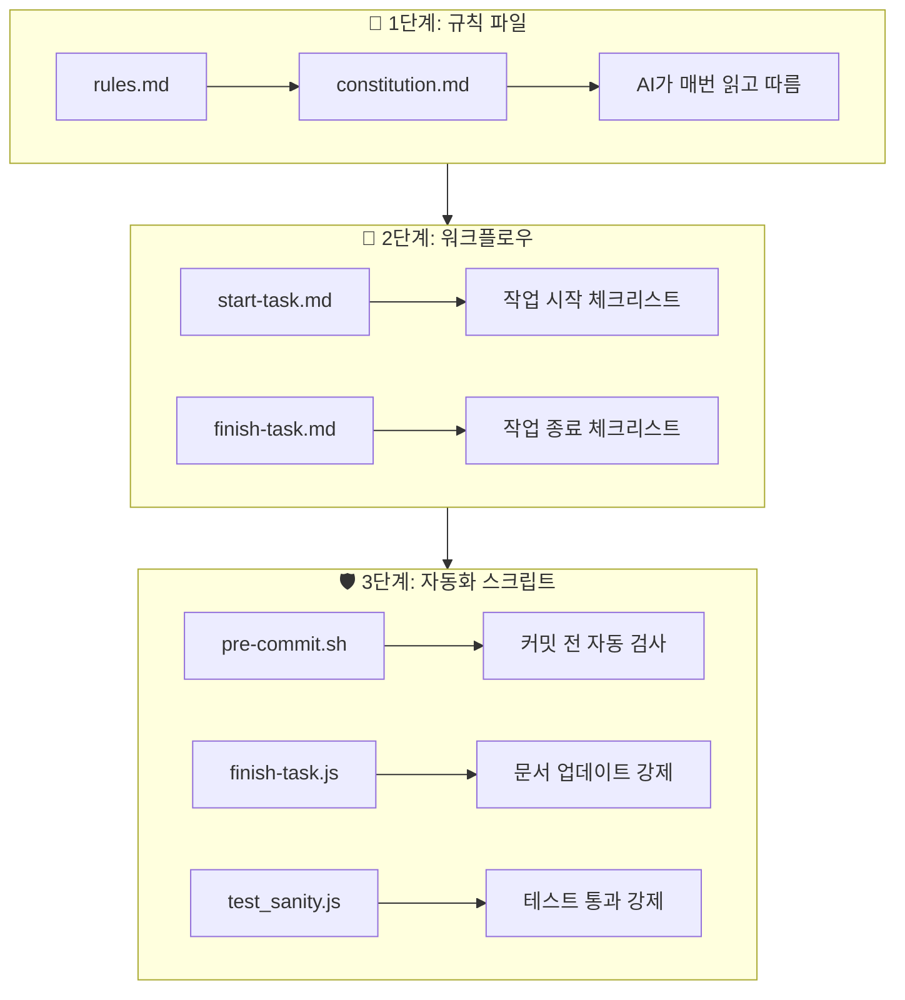
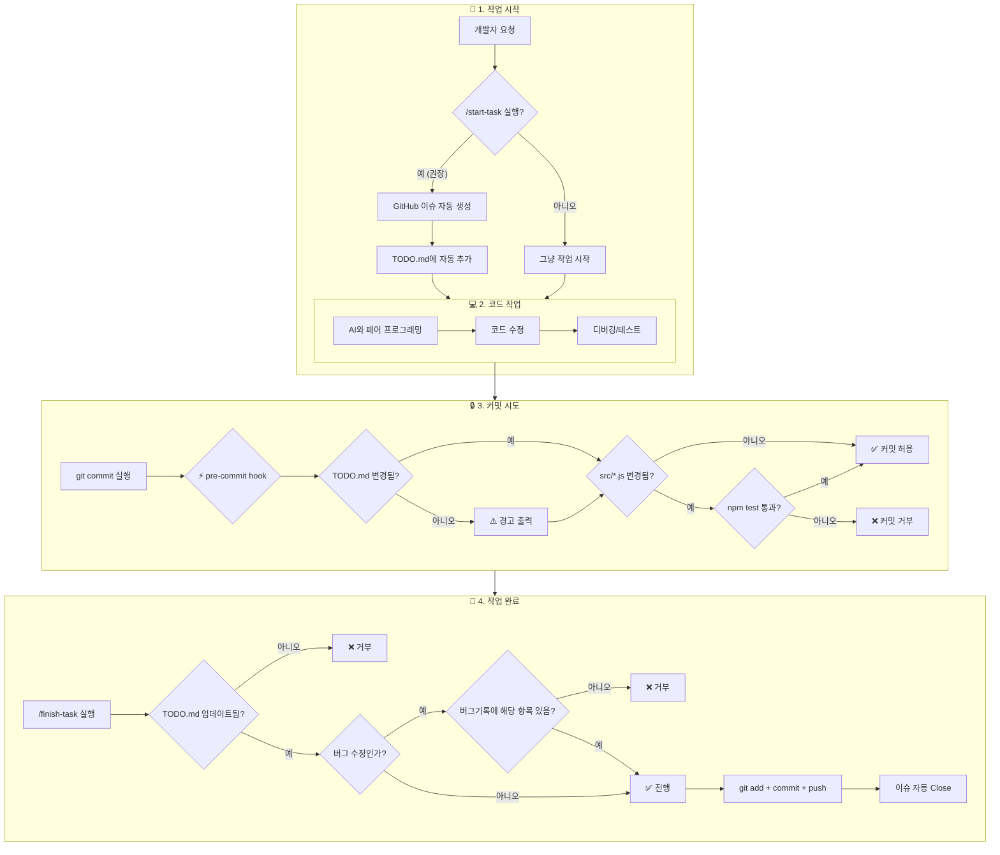

# 🤖 AI 협업 가이드: 에이전트와 함께 성장하는 개발

> **"기억에 의존하지 말고, 시스템으로 강제하라"**
> AI 에이전트와의 협업에서 발생하는 **망각(Amnesia)**, **맥락 이탈(Context Loss)**, **환각(Hallucination)**을
> 최소화하기 위한 실전 가이드입니다.

---

## 📚 목차

1. [문제 인식: AI 협업의 3대 적](#-1-문제-인식-ai-협업의-3대-적)
2. [해결 원칙: 기억 → 강제](#-2-해결-원칙-기억--강제)
3. [발전 과정: v1 → v2 → v3](#-3-발전-과정-v1--v2--v3)
4. [현재 시스템 아키텍처](#-4-현재-시스템-아키텍처)
5. [워크플로우 상세](#-5-워크플로우-상세)
6. [도구 및 스크립트](#-6-도구-및-스크립트)
7. [다른 프로젝트에 도입하기](#-7-다른-프로젝트에-도입하기)

---

## 🔴 1. 문제 인식: AI 협업의 3대 적

AI 에이전트와 장시간 협업하다 보면 반드시 마주치는 문제들이 있습니다.

### 1-1. 망각 (Agent Amnesia)

```
[증상]
사용자: "아까 정한 규칙 기억나?"
AI: "죄송합니다, 해당 규칙에 대한 기록을 찾을 수 없습니다."

[원인]
- 대화창이 길어지면 이전 맥락이 잘려나감
- 세션이 바뀌면 모든 기억 초기화
```

### 1-2. 맥락 이탈 (Context Loss)

```
[증상]
사용자: "SmartSorter 작업 이어서 해줘"
AI: "SmartSorter가 무엇인가요?"

[원인]
- 여러 파일/기능을 오가다 보면 현재 작업 목표를 잊음
- 복잡한 프로젝트에서 전체 구조 파악 실패
```

### 1-3. 환각 (Hallucination)

```
[증상]
AI: "이 함수는 utils.js 라인 42에 있습니다"
사용자: "그 파일에 그런 함수 없는데?"

[원인]
- 존재하지 않는 파일/함수를 확신하며 언급
- "있겠지"라는 추측을 사실처럼 말함
```

---

## 🟢 2. 해결 원칙: 기억 → 강제

> **핵심 철학**: AI에게 "기억해"라고 말하지 말고, "시스템이 강제하게" 만들어라.

### 2-1. 원칙 비교

| 기존 (기억 의존) | 개선 (자동 강제) |
|-----------------|-----------------|
| "작업 끝나면 TODO 업데이트 해" | **pre-commit hook**이 TODO 변경 확인 |
| "버그 수정하면 기록해" | **finish-task.js**가 버그기록 항목 검증 |
| "규칙 12개 암기해" | **5개 핵심**만 남기고 나머지 자동화 |
| "/start-task 꼭 실행해" | 선택사항으로 변경 (강제 불가 항목 제거) |

### 2-2. 3단계 방어선



---

## 📈 3. 발전 과정: v1 → v2 → v3

우리 시스템은 실패와 개선을 거쳐 진화해왔습니다.

### v1: 규칙 문서 시대 (실패)

```
📁 .gemini/
└── GEMINI.md  (규칙 12개 나열)

❌ 문제: AI가 규칙을 "읽기만" 하고 지키지 않음
❌ 문제: 규칙이 너무 많아 핵심을 놓침
```

### v2: 워크플로우 도입 (개선)

```
📁 .agent/
├── constitution.md     (핵심 규칙만)
└── workflows/
    ├── start-task.md   (작업 시작 절차)
    └── finish-task.md  (작업 종료 절차)

📁 scripts/
├── start-task.js       (이슈 자동 생성)
├── finish-task.js      (커밋/푸시 자동화)
└── test_sanity.js      (테스트 자동 실행)

⚠️ 문제: AI가 워크플로우를 "깜빡하면" 여전히 누락
```

### v3: 자동 강제 시스템 (현재)

```
📁 scripts/
├── pre-commit.sh       ⭐ [NEW] Git hook - 커밋 시 자동 검사
├── install-hooks.js    ⭐ [NEW] Hook 설치 스크립트
├── finish-task.js      ⭐ [ENHANCED] 버그번호 항목 존재 검증
└── test_sanity.js

✅ 해결: 규칙 위반 시 "커밋 자체가 거부됨"
✅ 해결: AI가 깜빡해도 시스템이 막아줌
```

---

## 🏗️ 4. 현재 시스템 아키텍처

### 4-1. 전체 흐름도



### 4-2. 파일 구조

```
📁 프로젝트 루트
├── 📁 .gemini/
│   └── rules.md              # 기술 스택만 명시 (간소화됨)
│
├── 📁 .agent/
│   ├── constitution.md       # 5개 핵심 규칙
│   └── 📁 workflows/
│       ├── start-task.md     # 작업 시작 (선택)
│       └── finish-task.md    # 작업 종료 (권장)
│
├── 📁 scripts/
│   ├── pre-commit.sh         # ⭐ Git hook 스크립트
│   ├── install-hooks.js      # Hook 설치 도구
│   ├── start-task.js         # 이슈 생성 자동화
│   ├── finish-task.js        # 커밋/푸시 자동화
│   └── test_sanity.js        # 핵심 로직 테스트
│
├── 📁 docs/
│   ├── TODO.md               # 작업 추적
│   └── 버그해결기록.md       # 버그 기록
│
└── 📁 .git/hooks/
    └── pre-commit            # 자동 설치됨
```

---

## 📋 5. 워크플로우 상세

### 5-1. 작업 시작 (선택 사항)

```bash
npm run start-task -- "작업 제목"
```

**수행 작업:**

1. GitHub 이슈 자동 생성
2. 이슈 번호 추출 (예: `#5`)
3. `docs/TODO.md`에 자동 추가

**선택 사항인 이유:**

- 강제할 수 없는 항목은 차라리 선택으로
- 안 하면 이슈 추적 안 될 뿐, 작업은 가능

### 5-2. 코드 작업

AI와 자유롭게 페어 프로그래밍. 특별한 제약 없음.

### 5-3. 커밋 (자동 검사)

```bash
git commit -m "fix: 버그 수정 (Closes #5)"
```

**pre-commit hook 자동 실행:**

```
🔍 Pre-commit 검사 시작...
   📋 TODO.md 변경 확인... ⚠️ 경고: 변경 안 됨
   🧪 테스트 실행 중... ✅ 통과
✅ Pre-commit 검사 완료!
```

### 5-4. 작업 완료 (권장)

```bash
npm run finish -- "fix: 버그 수정 (Closes #5) [버그]"
```

**수행 작업:**

1. TODO.md 업데이트 확인 (`git diff --name-only`)
2. 버그 수정 시 버그기록 해당 항목 존재 확인
3. `npm test` 실행
4. 모듈화 태그 확인 (`[MOD]`/`[RAW]`/`[N/A]`)
5. `git add .` + `git commit` + `git push`

---

## 🔧 6. 도구 및 스크립트

### 6-1. pre-commit.sh (핵심 방어선)

```bash
#!/bin/bash
# 커밋 전 자동 검사

# TODO.md 변경 확인 (경고만)
if ! git diff --cached --name-only | grep -q "docs/TODO.md"; then
    echo "⚠️ 경고: docs/TODO.md가 스테이징되지 않았습니다."
fi

# src/*.js 변경 시 테스트 강제
if git diff --cached --name-only | grep -q "^src/.*\.js$"; then
    npm test || exit 1
fi

exit 0
```

### 6-2. finish-task.js (검증 로직)

```javascript
// 핵심 검증 함수들

// 1. TODO.md 변경 확인
function checkTodoUpdated() {
    const result = execSync('git diff --name-only');
    return result.includes('docs/TODO.md');
}

// 2. 버그 수정 시 기록 확인
function checkBugLogEntry(issueNum) {
    const content = fs.readFileSync('docs/버그해결기록.md', 'utf8');
    return content.includes(`#${issueNum}`);
}

// 3. 모듈화 태그 확인
function checkModularizationTag(message) {
    return /\[(MOD|RAW|N\/A)\]/.test(message);
}
```

### 6-3. install-hooks.js (Hook 설치)

```bash
node scripts/install-hooks.js
```

**출력:**

```
🔧 Git Hooks 설치 스크립트

✅ Pre-commit hook 설치 완료!
   위치: .git/hooks/pre-commit

📌 이제 git commit 시 자동으로 검사가 실행됩니다.
```

---

## 🚀 7. 다른 프로젝트에 도입하기

### 7-1. 필수 파일 복사

```bash
# 1. 스크립트 복사
cp -r scripts/ 새프로젝트/scripts/

# 2. 규칙 파일 복사
cp -r .agent/ 새프로젝트/.agent/
cp -r .gemini/ 새프로젝트/.gemini/

# 3. 문서 템플릿 복사
cp docs/TODO.md 새프로젝트/docs/
cp docs/버그해결기록.md 새프로젝트/docs/
```

### 7-2. package.json 설정

```json
{
  "scripts": {
    "start-task": "node scripts/start-task.js",
    "finish": "node scripts/finish-task.js",
    "test": "node scripts/test_sanity.js"
  }
}
```

### 7-3. Hook 설치

```bash
node scripts/install-hooks.js
```

### 7-4. 커스터마이징

| 파일 | 수정 내용 |
|------|----------|
| `.agent/constitution.md` | 프로젝트별 핵심 규칙 추가 |
| `scripts/test_sanity.js` | 프로젝트별 테스트 케이스 추가 |
| `.gemini/rules.md` | 기술 스택 변경 |

---

## � 8. 세션 핸드오버 (맥락 전달)

AI 에이전트와의 대화 세션은 약 20턴 정도가 한계입니다. 세션이 바뀌면 AI는 이전 맥락을 잃어버리므로, **핸드오버 문서**를 통해 다음 세션 AI에게 맥락을 전달해야 합니다.

### 8-1. 핸드오버 명령어

```bash
/handover
```

사용자가 이 명령을 치면, AI가 자동으로:

1. Git 커밋/이슈/수정 파일 정보 수집
2. 세션 요약 작성
3. `docs/HANDOVER.md` 생성

### 8-2. HANDOVER.md 포함 내용

| 섹션 | 내용 | 맥락 기여도 |
|------|------|------------|
| 필수 문서 읽기 명령 | TODO.md, constitution.md, 버그기록 읽으라는 지시 | ~40% |
| 이번 세션 요약 | 완료/진행 중/다음 할 작업 | ~30% |
| 최근 수행한 동작 | `/handover` 직전에 AI가 한 실제 작업 | ~15% |
| 최근 커밋/이슈/파일 | Git/GitHub 자동 추출 | ~10% |
| 주의사항 | 프로젝트 특이사항 | ~5% |

**예상 맥락 복원율: ~95-100%**

### 8-3. 다음 세션 시작 시

```bash
# 새 세션 시작 시 AI에게 이렇게 말하세요:
docs/HANDOVER.md 읽어줘
```

### 8-4. 핵심 포인트

> [!IMPORTANT]
> `/handover` 실행 시 "가장 최근 수행한 동작"은 **명령 자체가 아니라**,
> 그 **직전에 AI가 하고 있던 실제 작업**을 기록해야 합니다.

---

## �📊 부록: 개선 효과 측정

### 변경 전후 비교

| 지표 | v1 (규칙 문서) | v3 (자동 강제) | 개선율 |
|-----|--------------|--------------|-------|
| 규칙 망각 발생 | ~5회/세션 | ~0회/세션 | **100%↓** |
| 문서 업데이트 누락 | ~30% | **0%** | **100%↓** |
| 테스트 없이 커밋 | ~50% | **0%** | **100%↓** |
| 규칙 파악 시간 | ~10분 | ~2분 | **80%↓** |

### 핵심 성공 요인

1. **규칙 간소화**: 12개 → 5개 (암기 가능한 수준)
2. **자동 강제**: 위반 시 물리적으로 커밋 불가
3. **선택/필수 구분**: 강제 불가능한 것은 선택으로

---

## 🎯 마무리

> **"AI는 완벽하지 않다. 그래서 시스템이 필요하다."**

이 가이드는 145번의 실패와 개선을 거쳐 만들어졌습니다.
AI 에이전트의 한계를 인정하고, 그 한계를 보완하는 시스템을 구축하세요.

**Remember**:

- 기억에 의존하지 말고 → **파일에 기록**
- 자발적 실행에 기대지 말고 → **자동화로 강제**
- 복잡한 규칙보다 → **간단한 핵심 + 도구의 힘**

---

**📅 Last Updated**: 2025-12-24
**🔖 Version**: 3.0 (Pre-commit Hook Era)
**👥 Authors**: AI & Human Collaboration Team
