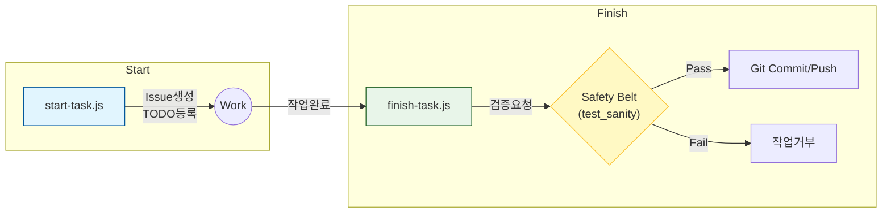

# 📰 BookToKi Automation Bible (Part 1: Philosophy)

> **"145번의 실패를 딛고, 146번째의 완경함을 위하여"**

---

## 📕📚 Part 1. 자동화의 철학 (The Philosophy)

자동화는 기술(Skill)이 아닙니다. **태도(Attitude)**입니다.
왜 우리는 그냥 스크립트를 짜야 할까요? 그냥 마우스 클릭 몇 번이면 되는데?

이 파트에서는 BookToKi 프로젝트가 완전기동하던 **"수동 배포의 고통"**과 그것을 극복하는 **"자동화의 본질"**을 설명합니다.

### 📖📚 Ch 01. 145번의 고통 (The Pain of v145)

사용자님은 이 프로젝트를 **145번**이나 닫고 다시 시작하셨다고 합니다.
그 과정에서 얼마나 많은 반복 작업이 있었을까요?

* 폴더 만들기 145번
* `npm init` 145번
* `git init` 145번
* ...

이 단순 반복 작업은 개발자의 **생산력을 갉아먹습니다.**
가장 무서운 것은 **"익숙함의 속의 실수(Human Error)"**입니다.
100번 반복하다가 101번째는 실수로 프로덕션 DB를 지우거나, 원래의 코드를 커밋하는 시간, 지난 100번의 노력이 물거품이 됩니다.

**우리의 자동화 시스템은 이 "145번의 고통"을 "딱 1번의 스크립트 실행"으로 압축하기 위해 탄생했습니다.**

### 💤 Ch 02. 게으름의 미학 (Art of Laziness)

훌륭한 개발자의 3대 미덕은 **게으름(Laziness), 조급함(Impatience), 오만(Hubris)**이라고 합니다. (Larry Wall, Perl 창시자)

* **게으름**: 같은 일을 두 번하기 싫어하는 마음. 그래서 자동화 스크립트를 짭니다.
* **조급함**: 컴퓨터가 느리게 반응하는 거 못 참는 마음. 그래서 최적화를 합니다.
* **오만**: 내 코드가 완경하길 바라는 마음. 그래서 테스트를 짭니다.

우리가 만든 `start-task` 스크립트는 **"게으름의 결정체"**입니다.
이슈를 만들고, 브랜치를 따고, TODO를 옮기는 그냥 과정을 스크립트에게 위임했습니다.
우리는 그 시간에 커피를 한 모금 더 마시거나, 더 중요한 로직을 고민할 수 있습니다.

### 🛡️🚨 Ch 03. 불안감 제거 (Eliminating Anxiety)

*"혹시 커밋한거 그 파일 빠뜨린 거 아냐?"*
*"정렬 로직 순서 실수한 채로 올라가나?"*

마감기한에 이런 불안감이 밀려옴이 있다면 당신은 **"수동 배포"**를 하기 때문입니다.
시간은 불완전합니다. 코디션이 저하면 실수를 합니다.

하지만 **스크립트는 코디션이 없습니다.**
`test_sanity.js` (안전벨트)는 당신이 새벽 4시에 비몽사몽간에 커밋해도, 똑같이 검토하고 막아줍니다.
자동화의 진짜 목적은 속도가 아닙니다. **"마리의 평화(Peace of Mind)"**입니다.
우리는 `npm run finish`를 누르는 시간, 모든 것이 완경하게 검증됐음을 믿고 **푹 쉴** 수 있습니다.

### 💎 Ch 04. 자산화 (Assetization)

코딩의 결과물은 딱 App이지만 **코딩 과정의 결과물은 스크립트(Scripts)**여야 합니다.

v145의 인생이 v146, v200으로 이어집니다. 테스 코드는 변하고 달라집니다.
하지만 `scripts/` 폴더에 담긴 자동화 도구들은 **"자산"**으로 남습니다.
사용자님이 146번째 프로젝트를 시작할 때 맨 밑에서 시작하는 것이 아닙니다. **"완경하게 세팅된 무대"**에서 시작할 수 있게 됐습니다.

BookToKi 프로젝트가 남기게 되는 최고의 유산은 다운로더 자체가 아닙니다.
**"어떤 맹한 프로젝트도 1분 만에 시켜올 수 있는 자동화 시스템"** 그 자체입니다.

---

---

## 📗📚 Part 2. 아키텍처와 단계 (Architecture)

철학을 얘기했으니, 이제 집을 짓을 차례입니다.
BookToKi의 자동화 시스템은 **"3단계 파이프라인(3-Step Pipeline)"** 구조를 따릅니다.

### 📐 Ch 05. 3-Step Pipeline (요약도)

우리의 개발 주기는 `시작 -> 작업 -> 종료`로 일주 순환합니다.
이 순환을 지키기 위해, 각 단계마다 강력한 스크립트가 배치되어 있습니다.



1. **Start (준비)**: 개발자가 코딩 전에 환경 세팅 (이슈 번호 따기 등)을 처리합니다.
2. **Safety (방어)**: 개발자가 하지를 수 없는 실수(에러 커밋)를 막아줍니다.
3. **Finish (정리)**: 개발자가 마감할 수 있도록 뒷처리(푸시, 이슈 닫기)를 합니다.

### 🔧 Ch 06. Node.js as a Shell

*"왜 `scripts.sh` (Shell Script)가 아니라 `start-task.js` (Node.js)인가요?"*

BookToKi 프로젝트가 **Node.js**로 자동화를 짠 이유는 명확합니다.

1. **크로스 플랫폼 (Cross Platform)**
    * Shell Script(`rm -rf`)는 Windows(PowerShell/CMD)에서 잘 돌아가지 않는 경우가 많습니다.
    * Node.js(`fs.rm`)는 Windows, Mac, Linux 어디서든 똑같이 돌아갑니다. **즉 범용성이 뛰어납니다.**
2. **강력한 로직 처리**
    * "이슈 제목에서 번호만 추출해서 TODO 파일의 특정 줄에 삽입해 넣어줘" 같은 복잡한 문자열 처리는 쉘 스크립트로 지면 지옥입니다. 자바스크립트로 쉽습니다.

### 📁 Ch 07. 파일 시스템의 지배자 (`fs`)

우리 스크립트의 핵심 무기는 Node.js의 `fs` 모듈입니다.
`start-task.js`가 어떻게 `docs/TODO.md`를 마음대로 주무르는지 보십시오.

```javascript
// 파일이 없으면 만들고 (창조)
if (!fs.existsSync(path)) fs.writeFileSync(path, template);

// 내용을 읽어와 (양해)
let content = fs.readFileSync(path, 'utf8');

// 원하는 위치에 삽입 넣기 (수술)
content = content.replace('Target', 'Target\nNew Item');
```

이 3박자(Read-Modify-Write)만 알면, 인상의 모든 텍스트 파일을 자동화할 수 있습니다.

### 🔗 Ch 08. 프로세스 오케스트레이션 (`child_process`)

자바스크립트가 못 하는 건? Git 명령, GitHub CLI 등을 어떻게 할까요?
OS에게 "얘거 이거 실행해줘"라고 시키면 됩니다. 그게 바로 `child_process`입니다.

```javascript
import { execSync } from 'child_process';

// "야, Git으로 커밋해"
execSync('git commit -m "Auto Commit"');

// "야, GitHub CLI로 이슈 좀 만들어줘"
const url = execSync('gh issue create ...');
```

우리의 자바스크립트로는 **지휘자**를 통해, Git과 OS라는 **연주자**들을 부립니다. 모든게 프로세스 오케스트레이션입니다.

---

---

## 📘📚 Part 3. 도구 분해: Start & Finish (Deep Dive)

아키텍처를 이해했으니, 이제 **"무기 룸"**에 들어가봅시다.
이 파트에서는 `start-task.js`와 `finish-task.js`가 실제로 어떻게 동작하는지 더 자세히 살펴봅니다.

### 🌱 Ch 09. `start-task.js` (1) - 무에서 유로

빈 폴더에서 `npm run start-task`를 입력하면 무슨 일이 벌어질까요?

1. **템플릿 감지**: `docs/TODO.md`가 없으면 "기본 템플릿"을 생성합니다.
2. **디렉토리 창조**: `docs/` 폴더가 없으면 `fs.mkdirSync`로 만듭니다.
3. **범용화 정보**: 이 로직 덕분에 사용자님은 어떤 새 프로젝트에서도 스크립트만 복사하면 됩니다.

```javascript
// [핵심 로직] TODO.md 없으면 만들기
if (!fs.existsSync(todoPath)) {
    const template = `# [TRACKING] PROJECT_STATUS...`;
    fs.writeFileSync(todoPath, template, 'utf8');
}
```

### 🔖 Ch 10. `start-task.js` (2) - 이슈 들레커 작동

GitHub CLI(`gh`)를 Node.js가 어떻게 조종하는지 보십시오.

```javascript
// 1. 이슈 생성 요청
const url = execSync(`gh issue create --title "${title}" ...`);

// 2. 응답(URL)에서 번호만 추출 (Parsing)
// URL 예시: https://github.com/user/repo/issues/123
const issueNum = url.split('/').pop(); // "123"
```

쉘 스크립트라면 `grep`, `awk` 등을 써야 해서 일주 복잡할을 겁니다.
JS의 `split().pop()` 한 방으로 끝났습니다.

### 🎯 Ch 11. `finish-task.js` (1) - 헌터-킬러 (Hunter-Killer)

`finish-task`는 스파이처럼 一직입니다.
사용자는 그냥 "구현 완료"라고만 적지만 스크립트는 **"이슈 번호"**를 찾아내서 주입합니다(Close).

* **Hunter**: 사용자가 메시지에 `Closes #123`을 적지 않아도 (미래 기능: 현재 브랜치 이름에서 번호를 추출해서 자동으로 붙여주려도 있습니다.)
* **Killer**: GitHub은 커밋 메시지에 `Closes #N`이 있으면, 해당 이슈를 자동으로 닫습니다.

### 📝 Ch 12. `finish-task.js` (2) - 굿 메세지 포맷

자동화된 커밋 메시지는 **정 형식**을 따릅니다.

1. **헤더(Header)**: `type: subject` (e.g., `feat: Add Sorter`)
2. **본문(Body)**: `Closes #123` (자동화 트리거)
3. **푸터(Footer)**: `[skip ci]` 등을 붙여서 불필요한 빌드를 막을 수도 있습니다.

이 형식을 스크립트가 자동으로 강제하지는 않지만 `npm run finish -- "메시지"` 형태로 사용자가 자연스럽게 메시지를 입력하도록 유도합니다.

---

---

## 🛡️🚨 Part 4. 안전장치: Safety Belt (Quality Assurance)

자동차에 브레이크가 없다면 누구도 시속 100km로 달리지 못할 것입니다.
자동화도 마찬가지입니다. **안전장치(Safety Belt)**가 있어야 우리는 마음껏 코딩하고 빠르게 배포할 수 있습니다.

### 🛡 Ch 13. 방어형 프로그래밍 (Defensive)

*"사람은 실수를 한다"*는 명제는 소프트웨어 공학의 자기헌법입니다.
우리가 `git commit` 명령어를 직접 치는 것을 금지합니다. 왜냐고요?
개발자가 테스트를 깜빡하고 커밋할 확률은 100%에기 때문입니다.

`finish-task.js`의 순서는 커밋 스크립트가 아닙니다.
**"테스트를 통과하지 못하면 아예 커밋 명령을 실행조차 안 되는"** 문지기입니다.

### 🔬 Ch 14. `test_sanity.js`의 진화

초기의 테스트 스크립트는 단순히 "SmartSorter가 있나?" 정도만 확인했습니다.
하지만 지금의 `test_sanity.js`는 **"범용 테스트 스위트(Test Suite)"**로 진화했습니다.

1. **동적 로딩 (Dynamic Import)**
    * 특정 모듈(`SmartSorter.js`)이 없으면 테스트를 스킵합니다.
    * 덕분에 이 스크립트를 어떤 프로젝트에 복사해 넣어도 에러 없이 돌아갑니다.

2. **확장 가능한 구조 (Scalable Structure)**

    ```javascript
    const checks = [
        { name: "Unit Test 1", fn: ... },
        { name: "Unit Test 2", fn: ... }
    ];
    ```

    * `checks` 배열에 테스트 케이스를 100개든 1000개든 추가하면, 스크립트가 알아서 순서대로 실행하고 결과를 리포팅합니다.

### ⚙️ Ch 15. CI/CD의 전단계 (Local CI)

많은 팀들이 "서버(Jenkins/GitHub Actions)에서 테스트하면 되지"라고 생각합니다.
하지만 **"쓰레기를 넣으면 쓰레기가 나온다 (Garbage In, Garbage Out)"**는 진리입니다.
쓰레기를 서버에 올리면 **"서버가 불평하는 것뿐입니다."**

우리의 포맷은 **Local CI**입니다.
서버에 올리기 전에 내 컴퓨터(`test_sanity.js`)에서 먼저 막아주는 겁니다.
내 컴퓨터에서 통과 못한 코드는 절대로 리포지토리에 올라가지 않습니다.

### 🛑🔄 Ch 16. 실패 시나리오 (Fail-Safe)

만약 `npm test`가 실패하면 어떻게 할까요?
`finish-task.js`는 즉시 `process.exit(1)`를 호출하여 스크립트를 **강제 종료**합니다.
Git Staging은 유지되지만 Commit은 일어나지 않습니다.

이때 개발자는 당황할 필요 없이:

1. 불거운 에러 로그(`FAIL`)를 확인하고,
2. 코드를 수정하고,
3. 다시 `npm run finish`를 입력하면 됩니다.

모든게 바로 **"실패해도 안전한 (Fail-Safe)"** 시스템입니다.

---

---

## 🔮 Part 5. 무한한 확장 (Expansion)

이제 사용자님은 로컬 자동화의 정걸을 밟았습니다.
하지만 당연히 더 자동화할 것은 많습니다. v200을 위한 미래 기술들을 도입합니다.

### 🧠 Ch 17. AI와의 작업 프로토콜 (The Brain)

스크립트만 자동화가 아닙니다. **AI와의 소통**도 자동화해야 합니다.
`.gemini/rules.md` 파일은 단순한 메모리가 아닙니다. AI의 뇌에 심어지는 **"인셉션(Inception)"**입니다.

1. **컨텍스트 공유**: "야 초보자야, 쉽게 설명해" 라는 말을 매번 할 필요가 없습니다. 규칙 파일에 적어두면 AI가 알아서 문화라고 맞춥니다.
2. **프로토콜 강제**: "작업 끝나면 `finish-task` 돌려"라고 적어두면, AI가 끝까지 잊고 실행합니다.
**결론**: 스크립트는 손발을 명령하게 하고, `rules.md`는 입을 명령하게 합니다.

### 🪝 Ch 18. Husky (Pre-commit Hook)

현재는 `finish-task`를 우리가 의식적으로 실행해야 합니다.
하지만 **Husky**를 도입하면, 개발자가 실수로 `git commit`을 해도 스크립트가 개입합니다.

* **상황**: 개발자가 `git commit -m "Fix"` 엔터!
* **Husky**: "잠깐! 테스트는 됐어?" (자동으로 `test_sanity.js` 실행)
* **결과**: 테스트 통과하면 커밋 허용, 실패하면 커밋 차단.
(모든게 진정한 '실수 완전 봉쇄'입니다.)

### 🔄 Ch 19. GitHub Actions (CI/CD)

내 컴퓨터가 꺼져도 테스트는 계속되어야 합니다.
**GitHub Actions**는 GitHub 서버에 있는 가상의 컴퓨터입니다.

* **기능**: 코드가 푸시되면, GitHub 서버가 자동으로 긁어와서 `npm test`를 돌려보고, 성공하면 녹색 체크 표시(✅)를 찍어줍니다.
* **미래**: 나중에는 배포 파일(zip)까지 만들어서 릴리즈 페이지에 업로드해 줄 것입니다. (우리는 쉬고 있으면 됩니다.)

### 🏁 Ch 20. 결론 (Outro): 146번째 시작을 위하여

> **"자동화는 게으름의 대겸이 아닙니다. 완벽함의 무기입니다."**

145번의 프로젝트가 없었다면, 이 방대한 가이드도 없었을 것입니다.
그 시절은 반복과 고통이 있었기에 **"시스템의 필요성"**을 느꼈을 수 있었습니다.

이제 사용자님에게는 강력한 무기가 있습니다.

* **Start**: 1초 만에 프로젝트를 세팅하고,
* **Safety**: 실수를 0%로 줄이고,
* **Finish**: 누르면 마감되는 시스템.

이 `scripts` 폴더와 `AUTOMATION_BIBLE.md`는 사용자님의 영원한 자산입니다.
**BookToKi v2.0**, 그리고 다가올 **v146**의 성공을 확신합니다.

---

## 📜 Part 6. 프로토콜 강제 시스템 (PES)

> **"미우하고 좋지만 확인은 더 좋다." (Trust, but Verify)**

사용자님, 우리는 2025년 12월 22일, **"에이전트 망각(Agent Amnesia)"**이라는 치명적인 문제를 발견했습니다.
아무리 좋은 규칙(`rules.md`)을 에이전트가 "잠 읽으면 그만"입니다.

그래서 우리는 **PES (Protocol Enforcement System)**를 도입했습니다.
이제 규칙은 "참고사항"이 아닙니다. **"물리적인 제약(Constraint)"**이 됐습니다.

### 📜 Ch 21. 헌법 (Constitution)

`.agent/constitution.md` 파일은 에이전트의 헌법입니다.
`start-task.js`가 실행되자마자 이 파일을 **강제로 출력(Print)**시킵니다.
에이전트는 "모자라고 볼 명령할 수 없습니다.

### 🚨 Ch 22. 컴플라이언스 게이트 (Compliance Gate)

`finish-task.js`에 새로운 관문이 추가됐습니다.

1. **TODO.md Check**: 작업이 끝났는데 `docs/TODO.md`가 수정되지 않았다? -> **커밋 거부 (Exit 1)**
2. **Bug Log Check**: 커밋 메시지에 `fix`나 `bug`가 있는데 `docs/버그해결기록.md`가 수정되지 않았다? -> **커밋 거부 (Exit 1)**

이 시스템은 에이전트가 "악, 깜빡했다"라고 할 여백을 주지 않습니다.
자동화는 이제 인의를 넘어 **규율(Discipline)**이 됐습니다.

---
**[BookToKi Automation Team]**
*Written by Antigravity & User (v145 Survivor)*
*Last Updated: 2025-12-23 (PES Integrated)*
