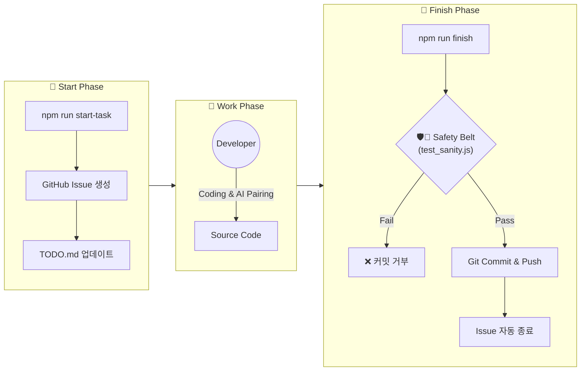

# 📖 [Bible] 개발 생산성 500% 향상을 위한 자동화 가이드

> **"게으름을 개발하려 하지말고, 개발하라."**
> 반복되는 작업은 스크립트와 AI에게 위임하고, 시간은 창의적인 일에만 집중하기 위한 **BookToKi 프로젝트의 자동화 아키텍처**를 설명합니다.

---

## 📚 목차 (Table of Contents)

1. **서론 (Intro)**: 왜 우리는 자동화를 했어야 하는가?
2. **아키텍처 (Architecture)**: 3-Step Pipeline (Start -> Safety -> Finish)
3. **도구 상세 (Tools Dictionary)**
    * 📌 `start-task`: 이슈 생성부터 환경 세팅까지 한번에
    * 🛡️🚨 `test_sanity` (Safety Belt): 커밋 전 불능 방어막
    * 🏁 `finish-task`: 마감 버튼 (커밋, 푸시, 이슈 종료)
4. **AI 파트너 (The Brain)**
    * `.gemini/rules.md`: AI에게 가르친 그라운드 룰
    * `.agent/workflows/`: AI가 따르는 작전 지시서 (SOP)
5. **범용화 가이드 (Universal Usage)**
    * "이 시스템을 다른 프로젝트에 복사하려면"
6. **확장편 (Advanced)**
    * CI/CD, GitHub Actions, Husky 등 고급 자동화 기술 도입

---

## 1. 아키텍처 (Architecture)

우리의 자동화 시스템은 **'작업의 시작과 끝'**을 감싸고 있습니다.



---

## 3. 도구 상세 (Tools Dictionary)

이 섹션은 `scripts/` 폴더 내의 **3개의 스크립트**에 대한 상세 매뉴얼입니다.

### 📌 A. 작업 시작: `npm run start-task`
>
> *"그냥 시작, 그렇게 멋지지?"*

* **기능**: GitHub 이슈 생성 및 로컬 `TODO.md` 업데이트 등 작업 준비 완료.
* **명령어**:

    ```bash
    npm run start-task -- "작업 제목 입력"
    ```

* **범용화**: `docs/TODO.md` 파일이 없으면 **자동으로 생성**됩니다. 즉 빈 프로젝트에서도 바로 사용 가능합니다.

### 🛡️🚨 B. 안전벨트: `npm test` (`scripts/test_sanity.js`)
>
> *"실수로 코드 망가뜨리고 커밋하는 것을 방지합니다."*

* **기능**: 핵심 로직(Core Logic)을 빠르게 테스트하여 건전성(Sanity)을 검증.
* **작동 원리**:
    1. `npm run finish` 실행 시 가장 먼저 호출됨.
    2. `checks` 배열에 정의된 테스트들을 순차 실행.
    3. **하나라도 실패하면(FAIL)**, 프로세스를 종료(Exit 1)하여 커밋을 막음.
* **확장법**: `checks` 배열에 원하는 테스트 함수(`fn`)만 추가하면 됨.

### 🏁 C. 작업 종료: `npm run finish`
>
> *"마감 준비 끝"*

* **기능**: 테스트 검증 → Git Staging → Commit → Push → Issue Close.
* **명령어**:

    ```bash
    npm run finish -- "커밋 메시지 (Closes #123)"
    ```

* **안전장치**: 앞서 설명한 **안전벨트(B)**가 내장되어 있어, 테스트 통과 없이는 절대 커밋하지 않습니다.

---

## 4. AI 파트너 (The Brain)

개발자가 마감해도 AI는 놀아지지 않습니다. 우리가 AI에게 **"어떻게 행동해야 하는지"** 가르쳐둔 규칙들입니다.

### 📝 `.gemini/rules.md` (헌법)

* **역할**: 프로젝트 내의 자기헌법을 정의합니다. (예: "한국어로만 소통해", "코드엔 항상 설명해")
* **작용**: AI가 답변을 생성하기 전에 이 파일을 먼저 읽고 "지켜야할 매너"를 맞춥니다.
* **핵심 규칙**:
    1. `[SYSTEM_CONTEXT]`: 사용자 프로필 (User Context)
    2. `[EXECUTION_PROTOCOL]`: 작업 끝나면 `finish-task` 돌리라는 명령
    3. `[NOISE_CONTROL]`: 잡담 금지

### 📋 `.agent/workflows/` (작전 지시서 - SOP)

* **역할**: 복잡한 작업을 단계별로 정의한 매뉴얼입니다. AI가 읽고 보고 따라 합니다.
* **주요 워크플로우**:
  * `start-task.md`: 작업 시작 시 체크리스트 (Issue 생성 등)
  * `finish-task.md`: 작업 종료 시 체크리스트 (TODO 정리 등)

---

## 5. 범용화 가이드 (Universal Usage)

*"이 시스템을 146번째 프로젝트에도 옮기고 싶은데?"*
**가능합니다. 1분이면 됩니다.**

### 🚚 이식(Migration) 3단계

1. **복사 (Copy)**: 현재 프로젝트의 `scripts/` 폴더를 통째로 새 프로젝트로 복사하세요.
2. **등록 (Register)**: 새 프로젝트의 `package.json`에 아래 3줄을 붙여넣으세요.

    ```json
    "scripts": {
      "start-task": "node scripts/start-task.js",
      "finish": "node scripts/finish-task.js",
      "test": "node scripts/test_sanity.js"
    }
    ```

3. **실행 (Run)**: `npm run start-task "첫 시작"`
    * ☝ `docs/TODO.md`가 없으면 **자동으로 만들어줍니다.**
    * ☝ `npm test`도 **기본적으로 통과**하도록 구성되어 있습니다. (나중에 채우면 됨)

> **팁**: `.gemini/` 폴더도 같이 복사하면 "나만의 AI 비서"를 패키지 형태로 이사 갖을 수 있습니다.

---

## 6. 확장편 (Advanced Level)

사용하시는 프로젝트가 커지면 아래 기술들을 도입해보세요.

### 🪝 Husky (Pre-commit Hook)

* **현재**: `npm run finish`를 실행해야만 테스트가 돌아감.
* **Husky 도입 후**: 개발자가 실수로 그냥 `git commit`을 해도, Husky가 가로채서 **강제로 테스트를 돌립니다.** (실수 완전 봉쇄)

### 🔄 GitHub Actions (CI/CD)

* **현재**: 로컬 컴퓨터에서 테스트하고 푸시합니다.
* **Actions 도입 후**: 푸시하면 **GitHub 서버**가 알아서 테스트하고, 빌드하고, 배포까지 3분 만에 끝납니다. (개발자는 에러 감시만)

---

## 7. 맺음말 (Outro)

> **"자동화는 '게으름'이 아닙니다. '투자'입니다."**

사용자님은 이제 **BookToKi v2.0** 뿐만 아니라, **v146, v200**까지 책임질 강력한 자동화 무기를 손에 쥐으셨습니다.
이 가이드를 통해 반복 작업을 줄이고, 창의적인 개발(SmartSorter 로직 개선 등)에 더 많은 시간을 투자하시길 바랍니다.

---
**[BookToKi Automation Team]**
*Last Updated: 2025-12-22*
